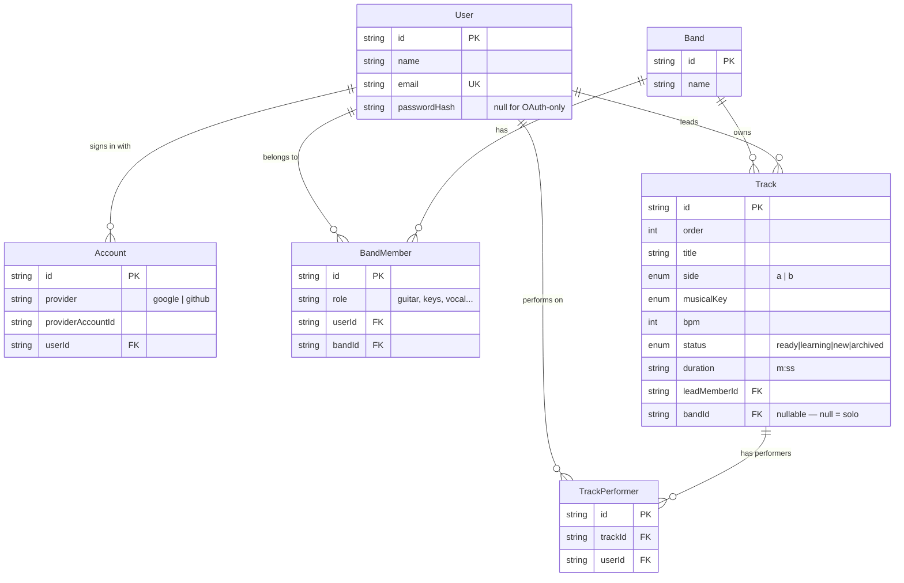

# Data model

PostgreSQL via Prisma. Schema: `packages/db/prisma/schema.prisma`.
Migrations: `packages/db/prisma/migrations/`.

## Entity relationships



## Notes per entity

### User

One person, one row. OAuth identities hang off `Account`, so the same user can
link Google *and* GitHub without duplicate rows. `passwordHash` is nullable —
it stays null until email+password auth is added.

### Band / BandMember

`BandMember` is the join table and carries `role` (the instrument or job in that
band), so the same user can be "guitar" in one band and "vocal" in another.

`@@unique([userId, bandId])` — one membership per user per band.
`@@index([bandId])` — the composite unique is keyed on `(userId, bandId)` and
doesn't help "list this band's members", so that access pattern gets its own
index.

### Track

`bandId` is **nullable**. A track with `bandId = null` is a *solo* track — part
of the user's personal repertoire, not any band's. This is why "Solo" is a
pseudo-band in the UI rather than a real `Band` row.

`@@unique([bandId, order])` gives each band a gap-free, deterministic track
order and prevents two tracks claiming position 3. Postgres excludes NULLs from
unique constraints, so solo tracks order independently of each other — an
accepted quirk, since solo ordering is per-user and never collides in practice.

`duration` is a `"m:ss"` string rather than an integer of seconds. Kept as-is
for display fidelity; sorting parses it in
`apps/api/src/repertoire/repertoire.service.ts`.

`musicalKey` is a Postgres enum. Prisma enum members must be valid identifiers,
so sharps are spelled out (`CSharp`) and `@map` keeps the DB label as `C#`.
`apps/api/src/utils/musical-key.util.ts` translates back for API responses.

### TrackPerformer

Many-to-many between `Track` and `User`: who else plays on this track besides
the lead.

**The lead member is implicitly a performer and has no `TrackPerformer` row.**
Any "does this user participate?" query must therefore check both:

```ts
{ OR: [{ leadMemberId: userId }, { performers: { some: { userId } } }] }
```

That predicate is the `participatesIn()` helper in `repertoire.service.ts` —
use it rather than rewriting the condition. See
[ADR 0002](../adr/0002-track-performers-model.md) for why the lead is modelled
separately.

## Migrations

```sh
pnpm --filter @nonsololarco/db db:migrate     # create + apply
pnpm --filter @nonsololarco/db db:generate    # regenerate the TS client
```

Both are needed after a schema edit. `db:migrate` changes the database;
`db:generate` changes the types your code compiles against. Doing only the
second produces `Cannot read properties of undefined (reading 'upsert')` at
runtime — the client knows about a model the database doesn't have.

## Seeding

```sh
pnpm --filter @nonsololarco/db db:seed
```

Everything is upserted by a fixed id or a natural unique key, so the seed is
idempotent — re-running it updates rows rather than duplicating them.

`prisma migrate reset` wipes the database including your OAuth user. Log in
again to recreate it, then seed with `SEED_USER_EMAIL` so the seed data attaches
to your real account instead of the placeholder:

```sh
SEED_USER_EMAIL=you@example.com pnpm --filter @nonsololarco/db db:seed
```
