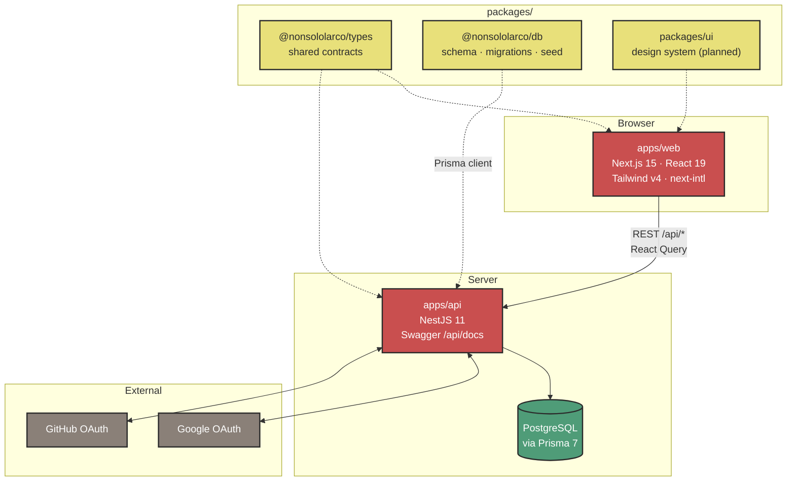
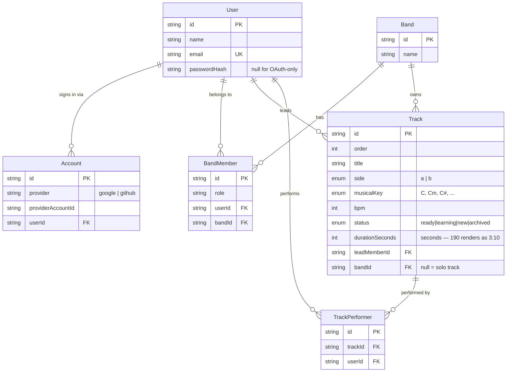
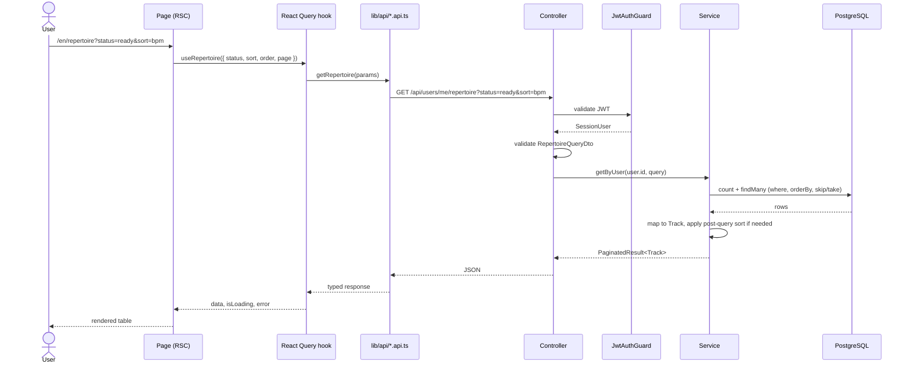
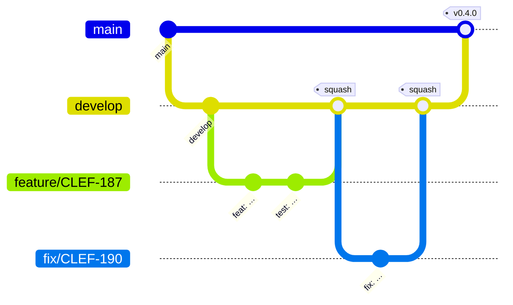

# System overview

Diagrams for humans. Mermaid renders natively on GitHub, diffs as text, and
cannot drift into a stale PNG nobody can edit.

> Machine-generated inventory (every component, route, util with test flags)
> lives in [`docs/ai/MAP.md`](../ai/MAP.md). This page is the shape of the
> system; that one is the contents.

---

## The whole thing at a glance

`packages/types` is the source of truth for anything crossing the wire. A shape
duplicated in `apps/web` instead of imported from there is a bug waiting for
the two copies to disagree.

---

## Data model

Two things the diagram cannot show:

- **`Track.durationSeconds` is an integer**, not the `"m:ss"` text it is shown
  as, so Postgres can order by it. The client formats — see
  [ADR 0005](../adr/0005-duration-as-seconds.md).
- **`@@unique([bandId, order])` does not constrain solo tracks.** Postgres
  treats NULL as distinct, so two tracks with `bandId = null` may share an
  `order`. See §4.3.

Full field-level reference: [`data-model.md`](./data-model.md).

---

## A request, end to end

**Filtering, sorting and pagination happen in the database**, never in the
frontend. The one remaining exception is sorting by `status`, whose Postgres
enum orders alphabetically rather than meaningfully — that path still loads
every matching row. See `docs/REFACTORING-PLAN.md` §4.2.

---

## Branching and release

Every change reaches `main` through `develop` — no exceptions except hotfixes,
which branch off `main` and are merged straight back into `develop`. Rules:
[`../ai/GIT.md`](../ai/GIT.md). Rationale:
[ADR 0004](../adr/0004-two-branch-model.md).

---

## Frontend layering

```mermaid
graph TD
    PAGE["app/[locale]/**/page.tsx"]
    FEAT["components/&lt;feature&gt;/<br/>repertoire · profile · metronome"]
    DS["components/ui/<br/>14 primitives"]
    QUERY["lib/hooks/<br/>React Query"]
    APIC["lib/api/<br/>fetch + client.ts"]
    STATE["hooks/global/<br/>useAuth · useTheme · useActiveBand"]
    UTIL["utils/ · lib/variants/ · lib/constants/"]

    PAGE --> FEAT
    PAGE --> QUERY
    FEAT --> DS
    FEAT --> QUERY
    FEAT --> STATE
    QUERY --> APIC
    DS --> UTIL
    FEAT --> UTIL

    classDef bad stroke-dasharray: 5 5
    DS -.->|"NEVER"| STATE
    DS -.->|"NEVER"| QUERY
    class DS bad
```

**The dashed arrows are the rule worth enforcing mechanically.** A design-system
component that reaches for `useAuth` or a React Query hook stops being reusable
— it now depends on this app's session and server. Once `packages/ui` exists
(plan §2.4), the package boundary makes it impossible; until then it is a
convention `dependency-cruiser` can check.

---

## Keeping these current

| Diagram           | Risk of going stale            | Mitigation                                                    |
| ----------------- | ------------------------------ | ------------------------------------------------------------- |
| System overview   | Low — changes rarely           | Review when a package is added                                |
| Data model        | **High** — every schema change | Generate from `schema.prisma` with `prisma-erd-generator`     |
| Request flow      | Medium                         | Review when a layer is added                                  |
| Branching         | None                           | Fixed by ADR 0004                                             |
| Frontend layering | Medium                         | Enforce with `dependency-cruiser`, which also emits the graph |

The two marked as generatable should be generated. A hand-drawn ERD is wrong
within a month, and nobody notices until it misleads someone.
